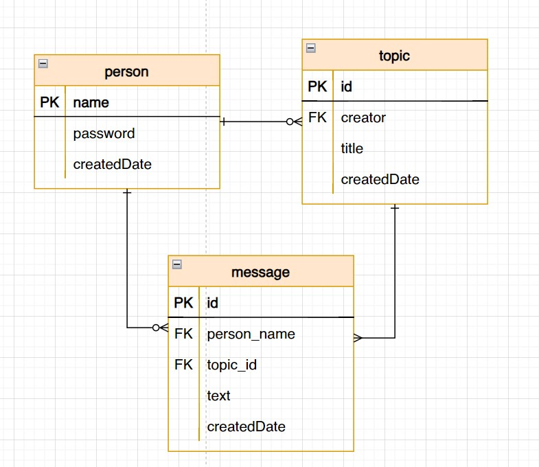

# Тестовое задание Java

Требуется создать простейший движок форума/доски объявлений.

## Суть задачи

1. Есть топики (темы), в каждом топике может быть одно или более сообщений.
2. Движок должен обеспечивать хранение в БД (IMDB) и CRUD операции с топиками и сообщениями в топиках.
3. Топик должен содержать заголовок (название темы). Топик не может быть пустым, т.е. должен содержать как минимум одно сообщение.
4. Сообщение должно содержать имя (ник) автора, текст сообщения, дату создания.
5. Сообщение обязательно должно относиться к одному из топиков.
6. Необходимо реализовать клиентский REST-API позволяющий пользователю:


## Использованные технологии

**Язык** - Java 17

**Автоматизация сборки** - Maven

**Фреймворки**:
* Spring Boot 3.2.4
* Spring Data (JPA)
* Spring Security (HTTP Basic Auth)
* Redis (Jedis)

**База данных** - H2

In-memory база данных H2 хранит данные в оперативной памяти, что ускоряет их обработку.

Операции с данными соответствуют ACID принципам благодаря транзакционному управлению Spring Data.

Spring Security вводит ограничения безопасности HTTP Basic Auth.

## Запуск приложения

Для запуска приложения необходимо:
1. Клонировать репозиторий:
```shell
git clone https://github.com/stepagin/atom-id-test-task.git
```

2. Установить зависимости командой 

**На Linux:**
```shell
mvn clean install
```

**На Windows:**
```shell
./mvnw clean install
```

3. Поменять в application.properties хост и порт для подключения к серверу Redis

NB: При локальном подключении необходимо установить Redis на машину и ввести ``app.redis.host=127.0.0.1``, ``app.redis.port=6379``

4. Запустить приложение через IDE или собрать и запустить Jar-файл командами:

**На Linux:**
```shell
mvn clean package
```

**На Windows:**
```shell
./mvnw clean package --% -Dmaven.test.skip=true
```

**Файл появится в папке target и его можно будет запустить:**
```shell
java -jar ./target/atom-id-0.1.jar
```


Приложение запустится локально на порту ``18001``, его можно изменить в ``application.properties``

## Результаты работы

Приложение реализовано в виде микросервиса с собственной базой данных.

### Проектирование базы данных

Всего потребовалось 3 сущности:
* Тема (Topic)
* Сообщение (Message)
* Человек (Person)

Схема инфологической модели предметной области (БД):



### Обработка и валидация

Реализовано следующее:

* Название топика может быть длиной от 2 до 256 символов
* Сообщение может быть любой длины от 1 символа
* Поддерживаются сообщения огромного размера (10 000 символов и более)
* Имя пользователя должно быть не менее 4 символов
* Пароль должен быть не менее 6 символов
* Пароль шифруется BCryptPasswordEncoder, поэтому даже одинаковые пароли имеют разные записи в базе данных

## Задания на дополнительный балл

### Авторизация и безопасность

Приложение защищено HTTP Basic Auth (через логин и пароль). Для работы необходимо передавать логин и пароль пользователя в заголовке каждого запроса, кроме:

* создания нового пользователя
* просмотра состояния базы данных H2

### Пагинация

Реализовано постраничное отображение для запросов:
* получения списка всех топиков
* получения списка сообщений у топика

Чтобы выбрать страницу можно передать параметры:
* ``page`` - номер страницы. Отсчёт начинается с ``0``, по умолчанию ``0``
* ``size`` - размер страницы. По умолчанию ``20``

## Пример API

API соответствует примеру из условия. 

Вы можете посмотреть её документацию в Postman [по ссылке](https://documenter.getpostman.com/view/33960847/2sA3BoarmD).

## Просмотр состояния базы данных

Перейдите по url:
```
http://localhost:18001/h2-console/
```


В открывшуюся форму необходимо ввести следующие данные JDBC URL: ```jdbc:h2:mem:atomid```

Пользователь: ``root``

Пароль: ``root``

В открывшемся окне можно выполнять sql запросы.

Данные для подключения к БД можно изменить в файле ``application.properties``.

